  

  

  LGNlts

<pre><code style="display:block; margin:0 auto; max-width:720px; background:rgba(255,255,255,0.04); border:1px solid rgba(255,255,255,0.09); border-radius:12px; color:#f5f5f5; font-family:JetBrains Mono, monospace; font-size:13px; line-height:1.7; padding:16px 18px; text-align:left; overflow:auto;">
root@system:~$ whoami
</code></pre>

  Engenheiro em formação focado em resolver o caos corporativo através de <strong>código</strong> e <strong>arquitetura</strong>. 
  Unindo desenvolvimento <strong>Full-Stack</strong> à orquestração de <strong>Infraestrutura</strong>, construo sistemas que são:
    
  escaláveis por design · automatizados por necessidade · seguros por padrão

  

<pre><code style="display:block; margin:0 auto; max-width:720px; background:rgba(255,255,255,0.04); border:1px solid rgba(255,255,255,0.09); border-radius:12px; color:#f5f5f5; font-family:JetBrains Mono, monospace; font-size:13px; line-height:1.7; padding:16px 18px; text-align:left; overflow:auto;">
root@system:~$ ls stack/
</code></pre>

  
  
  
  
  
   
  
  
  
  

  

<pre><code style="display:block; margin:0 auto; max-width:720px; background:rgba(255,255,255,0.04); border:1px solid rgba(255,255,255,0.09); border-radius:12px; color:#f5f5f5; font-family:JetBrains Mono, monospace; font-size:13px; line-height:1.7; padding:16px 18px; text-align:left; overflow:auto;">
root@system:~$ ls experiencia/
</code></pre>

  

    <strong style="font-size:16px;">Sebrae</strong> · Administração de Infra & Desenvolvimento Interno
    <pre><code style="display:block; margin-top:10px; background:rgba(255,255,255,0.04); border:1px solid rgba(255,255,255,0.08); border-radius:12px; color:#f5f5f5; font-family:JetBrains Mono, monospace; font-size:12px; line-height:1.7; padding:16px 18px; overflow:auto;">
$ cat sebrae_ap.log
[stack]  VMware · Active Directory · Zabbix · React · Tailwind
[log]    > Administração de infraestrutura de TI corporativa.
         > Monitoramento ativo de rede e hardware via Zabbix e Nagios.
         > Desenvolvimento de aplicações web e dashboards interativos
           para gestão de dados.
    </code></pre>
  

  

    <strong style="font-size:16px;">Gestor de Obras</strong> · Desenvolvimento Backend
    <pre><code style="display:block; margin-top:10px; background:rgba(255,255,255,0.04); border:1px solid rgba(255,255,255,0.08); border-radius:12px; color:#f5f5f5; font-family:JetBrains Mono, monospace; font-size:12px; line-height:1.7; padding:16px 18px; overflow:auto;">
$ cat gestor_de_obras.log
[stack]  Node.js · Python · PostgreSQL
[log]    > Arquitetura e manutenção de APIs focadas em performance.
         > Modelagem relacional e gerenciamento otimizado em banco
           de dados.
    </code></pre>
  

  

  <pre><code style="display:inline-block; background:rgba(255,255,255,0.04); border:1px solid rgba(255,255,255,0.08); border-radius:10px; color:#f5f5f5; font-family:JetBrains Mono, monospace; font-size:12px; line-height:1.5; padding:12px 16px;">
root@system:~$ exit 0
  </code></pre>
  
EOF █

